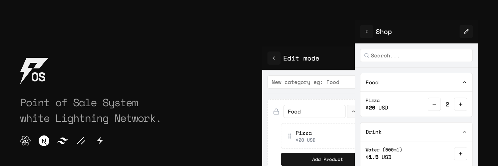

# lightning-pos

Point of Sale System with Lightning Network



## 🏗️ Technical

- Frontend: Next.js 14 (App Router), React 18, TypeScript
- UI: Tailwind CSS, shadcn/ui components
- Storage: IndexedDB (local), localStorage (configuration)
- PWA: Service Worker, Web App Manifest
- Payments: Lightning Network (LUD-16/LUD-21), NFC Web API

## 🏁 Getting Started

See [FLOW](./FLOW.md).

### Prerequisites

- Node.js 18+ and npm
- Git

### Installation

This project uses npm to install dependencies and run scripts.

1. Clone the repository:
```bash
git clone https://github.com/unllamas/lightning-pos.git
cd lightning-pos
```

2. Install dependencies:
```bash
npm install
```

3. Run the development server:
```bash
npm run dev
```

4. Open [http://localhost:3000](http://localhost:3000) in your browser.


## 🤝 Contributing

Contributions are welcome! Please feel free to submit a Pull Request.

1. Fork the repository
2. Create your feature branch (`git checkout -b feature/amazing-feature`)
3. Commit your changes (`git commit -m 'Add some amazing feature'`)
4. Push to the branch (`git push origin feature/amazing-feature`)
5. Open a Pull Request

## 📄 License

This project is licensed under the MIT License - see the LICENSE file for details.

## 💌 Contact

If you have any questions or concerns about **Lightning-Pos**, please contact the developer at [npub1em3g0wcfjz5we0gaaelw07fcyqys3fwg42qykw774mvgala424rsl26ytm](https://njump.me/npub1em3g0wcfjz5we0gaaelw07fcyqys3fwg42qykw774mvgala424rsl26ytm).